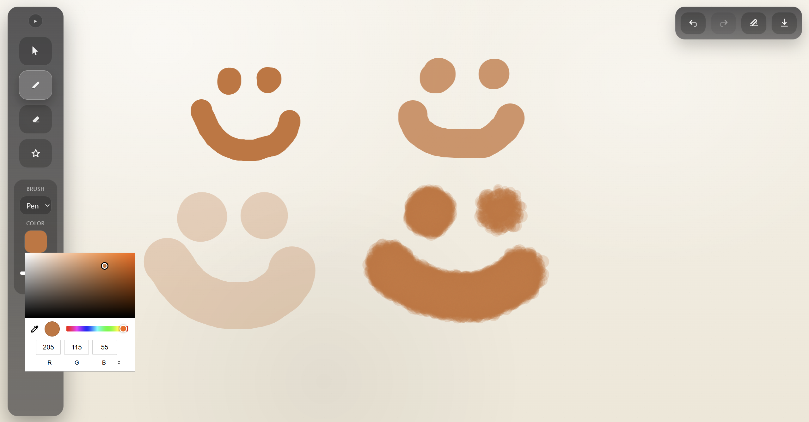
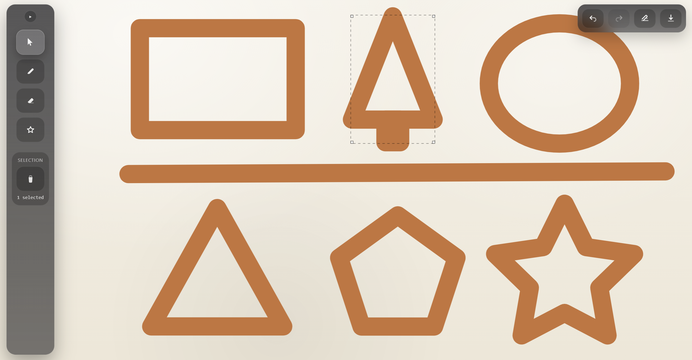

# 🎨 Whiteboard Canvas App

A modern interactive whiteboard built with **React + TypeScript** and powered by the **HTML5 Canvas API**. This project focuses on building a scalable drawing engine with a custom UI system, and advanced shape/brush tools from scratch.

## 🚀 Live Demo

👉 https://boardly-fawn-sigma.vercel.app/

## 📸 Screenshots




---

## ✨ Features

* Freehand drawing with smooth brush rendering
* Multiple shape tools (rectangle, circle, triangle, star, line, pentagon, heart, umbrella, etc.)
* Selection and transformation system
* Custom color picker and brush styling
* Gradient / experimental color modes
* Undo / redo history stack
* Floating sidebar UI inspired by professional drawing tools
* Responsive canvas rendering
* Clean separation between rendering engine and UI layer

---

## 🛠 Tech Stack

* **React** — UI architecture and state management
* **TypeScript** — strong typing and safer refactoring
* **Vite** — fast development environment
* **HTML5 Canvas API** — rendering engine
* **Modern CSS** — custom UI styling

---

## 🚀 Getting Started

```bash
npm install
npm run dev
```

Open:

```
http://localhost:5173
```

---

## 🧠 Architecture Overview

The app is structured around a clear separation between:

### 1. Rendering Engine

A canvas-driven drawing engine responsible for:

* shape math
* brush stroke interpolation
* hit testing
* redraw cycles
* history replay

The canvas is treated as a deterministic renderer: every frame can be reconstructed from application state.

### 2. Application State Layer

React manages:

* active tool
* brush settings
* shape parameters
* selection state
* history stack

Canvas drawing is triggered by state transitions rather than direct DOM mutation.

### 3. UI Layer

A floating sidebar system provides contextual controls without polluting the drawing surface.

---

## ⚙️ Engineering Decisions

This project involved several non-trivial engineering challenges.

### 🔹 Normalizing Shape Geometry

**Problem:**
Shapes behaved inconsistently depending on drag direction (top-left → bottom-right vs reverse).

**Solution:**
All shapes use normalized bounding boxes:

* coordinates are converted to a consistent top-left origin
* width and height are always positive
* rendering math becomes direction-agnostic

This guarantees stable shape generation.

---

### 🔹 Canvas Redraw Strategy

**Problem:**
Incremental drawing caused visual artifacts and made undo/redo unreliable.

**Solution:**
The renderer uses a **state replay model**:

* every stroke/shape is stored as data
* the canvas is fully redrawn from history when needed

This makes undo/redo deterministic and simplifies state reasoning.

---

### 🔹 Decoupling UI From Rendering

**Problem:**
Direct coupling between UI events and canvas drawing created fragile logic.

**Solution:**

A clean separation was enforced:

* UI modifies application state
* renderer consumes state and draws

This architecture supports future expansion like:

* layers
* animations
* collaborative editing

---

### 🔹 Hit Testing and Selection

**Problem:**
Accurate selection of shapes requires geometric hit testing.

**Solution:**
Each shape exposes a bounding box and hit detection logic. Selection is computed mathematically rather than visually.

This avoids pixel-based hacks and scales to complex scenes.

---

### 🔹 Performance Considerations

Canvas redraws are optimized by:

* minimizing unnecessary re-renders
* batching updates
* avoiding React-driven canvas painting loops

React controls state — Canvas handles pixels.

---

## 🎯 Design Goals

This project was built to explore:

* interactive graphics programming
* scalable frontend architecture
* custom UI system design
* performance-conscious rendering
* maintainable TypeScript patterns

It intentionally avoids external drawing libraries to focus on core engineering.

---

## 🔮 Future Improvements

Planned or possible extensions:

* layer system
* SVG export
* animated brushes
* advanced gradients
* snapping and alignment tools
* collaborative real-time editing
* plugin architecture

---

## 📄 License

MIT License

---

## 🙌 Author

Built as a frontend engineering portfolio project focused on canvas rendering and UI architecture.(I will add backend later so you can log in and save your drawings <3 )

